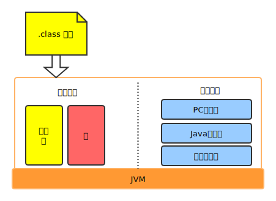
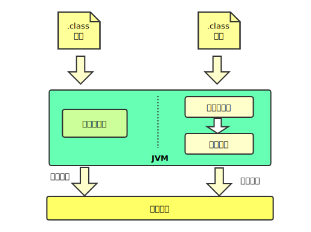

## Java 字节码如何在虚拟机中运行的

**以 HotSpot 为例，从两个角度分析：**

### 从虚拟机角度

要执行 Java 代码，首先就需要将它们编译成 class 字节码文件然后加载到 JVM 中，加载后的 Java 类会被存到方法区内，实际运行时，虚拟机会执行方法区内的代码(此处需要有操作系统的内存管理知识)。JVM 会在内存中划分出堆和栈来存储运行时的数据，在栈的基础上又划分出面向 Java 语言的 Java 方法栈和面向 C++ 语言的 native 方法栈，以及存放各线程执行位置的 PC寄存器。

在运行过程中，每当调用进入一个 Java 方法，JVM 会在当前线程的 Java 方法栈中生成一个栈帧，用来存放局部变量和字节码操作数。这个栈帧的大小是提前设计好的，而且 JVM 不要求栈帧在内存空间里连续分布。当退出当前执行方法时，不管正常返回还是异常返回，JVM 都会弹出当前栈帧并将其舍弃。

### 从硬件角度看
字节码无法直接运行，而是需要将它们转化成机器码。在 HotSpot 中，一种是解释执行，即一边将字节码转成机器码一边执行，另一种是即时编译(JIT)，即先统一转化后再执行。

解释执行的优势在于无需等待编译，即时编译的优势在于实际运行速度快(不包括编译时间)。
HotSpot 采用的是混合模式(mixed mode)，即先解释执行字节码，然后将反复执行的热点代码以方法为单位进行即时编译。
***
## Java 虚拟机如何加载 Java 类的

JVM 加载 Java 类可以分成加载、连接和初始化。

**加载：** 查找字节流并据此创建类的过程。加载需借助类加载器(ClassLoader)，在 JVM 中，类加载器使用了双亲委派模型，即接收到加载请求时，会先将请求转发给父类加载器。
应用类加载器->扩展类加载器->启动类加载器。

**链接：** 将创建成的类合并至 JVM 中，使之能够执行的过程。链接还分验证、准备和解析三个阶段，分别完成，“验证被加载类是否满足 JVM 约束”，“为被加载类静态字段分配内存”，“将被加载类中的符号引用解析成实际引用”的工作。其中， JVM 规范不要求解析阶段一定要在链接步骤中完成。

**初始化：**  将标记为常量的字段赋值，以及执行<clinit>方法的过程。类的初始化进会被执行一次，这个特效被用来实现单例的延迟初始化。
***
## Java 虚拟机是如何进行垃圾回收的
JVM 中的 GC 采用``可达性分析``来探索所有的存活对象。它从 GC Roots 出发，一边标记一边探索所有存活的对象。为了防止在标记过程中发生堆栈状态的改变，JVM 采用安全机制来实现 Stop the World (STW)操作，暂停其它 ``非GC`` 线程。

回收垃圾对象的内存共有三种基础的算法：
 - 会造成内存碎片的清除算法
 - 性能开销较大的压缩算法
 - 堆使用率较低的复制算法

 通常来说， JVM 会采用分代回收思想，将堆划分为新生代(Young)和老年代(old)，并在不同的代中使用不同的 GC 算法。传统的做法是将新生代再划分成 Eden 区和两个大小一致的 Survivor 区，在只针对新生代的 Minor GC 中，Eden 区和非空 Survivor 区将会被复制到另一个 Survivor 区中，当 Survivor 区中的存活对象复制次数超过一定次数后将会晋升到老年代。

 因为 Minor GC 只针对新生代进行垃圾回收，所有在枚举 GC Roots 时需要考虑从老年代到新生代的引用，为避免扫描整个老年代区，JVM 引入了名为``卡表``的技术，大致的标出可能存在老年代到新生代的引用内存区域。

 G1 GC 将堆分成很多个等大的区域(Region)，每个区域可以充当 Eden 区、Survivor 区或者老年代区。G1 会优先收集垃圾最多的区域，从而最大化垃圾回收的效益。这也是 Garbage First 名字的由来。

 Java11 中引入实验性的 ZGC ，仅在扫描 GC Roots 时请求 STW ，暂停应用线程，因此它宣称可将 GC 暂停时间控制在 10ms 以下。ZGC 暂时没有应用之前的分代回收思路，将堆看成一个整体，其代价是垃圾回收会消耗较高的 CPU。
***
## Java 内存模型是什么(JMM)
在现代操作系统中，代码通常不会按照书写顺序执行。造成这个问题的原因有三个，分别为：编译器的重排序，处理器的乱序执行，以及内存系统的重排序。
以内存系统重排序为例，在多处理器体系架构下，每个处理器可能缓存了一部分数据。由于时刻保持缓存数据与内存数据同步的性能代价太大，因此部分体系架构可能允许缓存数据与内存数据不同步。这对 Java 线程的影响就是，两个不同的 Java 线程在同一时间内看到的同一块内存地址中的值可能不同。

Java 内存模型是针对上述问题而提出的一套规范，用以允许 Java 程序员更为细致地定义 Java 程序的内存行为。它通过定义了一系列的 happens-before 操作，让应用程序开发者能够轻易地表达不同线程的操作之间的内存可见性。

Java 内存模型是通过内存屏障来禁止重排序的。对于即时编译器来说，内存屏障将限制它所能做的重排序优化。对于处理器来说，内存屏障会导致缓存的刷新操作。
